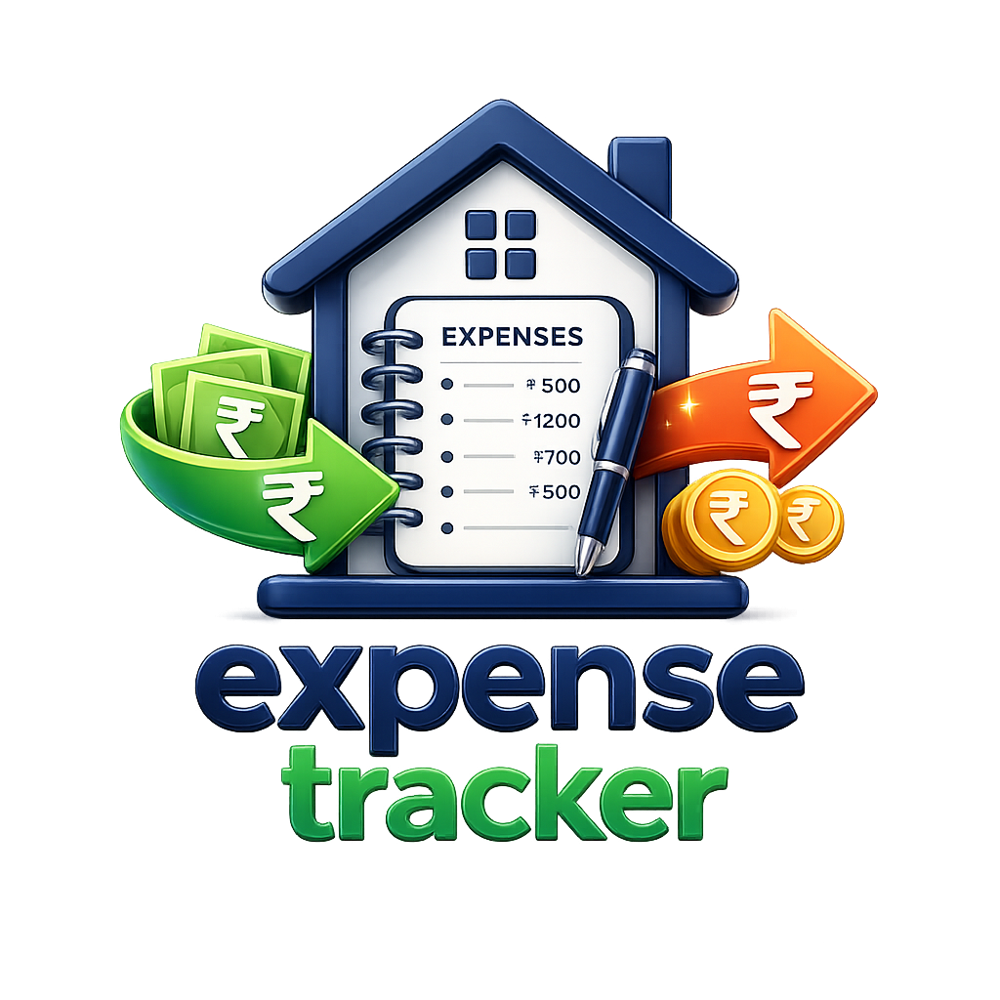

# Household Expense

<p align="center">
  
</p>

**Secure, on-device household finance tracker** for Android and iOS — budgets, bank statement import, analytics, encrypted backup, and a clear free-trial → yearly Pro model.

| | |
|---|---|
| **Package / Bundle ID** | `com.householdexpense.app` |
| **Version** | `1.0.0+1` |
| **Platforms** | Android · iOS (primary) · also macOS / Linux / Windows / web shells |
| **Stack** | Flutter · SQLCipher · Secure Storage · AdMob · In-App Purchase |

---

## Product summary

Household Expense helps families track spending and income **entirely on the device**. Data is stored in an encrypted SQLite (SQLCipher) database. Users register once, unlock with PIN/password (optional biometrics), manage expenses and income, set budgets and goals, import bank statements (CSV / Excel / PDF), export reports, and back up with AES-GCM encryption.

**Monetization**

| Phase | Access | Ads |
|-------|--------|-----|
| Free trial (3 months from registration) | All features | Shown |
| Trial ended, no purchase | App blocked until purchase | — |
| Yearly Pro (`household_expense_yearly_1800`, ₹1800 / 1 year) | All features | Ad-free |

---

## Feature documentation (PRDs)

Detailed product requirements for each feature area live under [`docs/prd/`](docs/prd/):

| # | Feature | Document |
|---|---------|----------|
| 1 | Authentication & security | [01-auth-and-security.md](docs/prd/01-auth-and-security.md) |
| 2 | Expenses & income | [02-expenses-and-income.md](docs/prd/02-expenses-and-income.md) |
| 3 | Budgets & goals | [03-budgets-and-goals.md](docs/prd/03-budgets-and-goals.md) |
| 4 | Analytics & insights | [04-analytics-and-insights.md](docs/prd/04-analytics-and-insights.md) |
| 5 | Bank statement import | [05-bank-statement-import.md](docs/prd/05-bank-statement-import.md) |
| 6 | Export & encrypted backup | [06-export-and-backup.md](docs/prd/06-export-and-backup.md) |
| 7 | Ads & subscriptions | [07-ads-and-subscriptions.md](docs/prd/07-ads-and-subscriptions.md) |
| 8 | Household members & accounts | [08-household-and-accounts.md](docs/prd/08-household-and-accounts.md) |
| 9 | Recurring transactions | [09-recurring-transactions.md](docs/prd/09-recurring-transactions.md) |
| 10 | Settings, help & feedback | [10-settings-help-feedback.md](docs/prd/10-settings-help-feedback.md) |
| 11 | Admin feedback console | [11-admin-feedback.md](docs/prd/11-admin-feedback.md) |

Also see:

- [Privacy policy draft](docs/PRIVACY_POLICY.md)
- [Google Play release checklist](docs/GOOGLE_PLAY_RELEASE_CHECKLIST.md)
- [Android release notes](android/RELEASE.md)
- [iOS release notes](ios/RELEASE.md)
- [iOS setup roadmap](IOS%20APP/README.md)

---

## App structure (user-facing)

```
AuthGate
  └─ ExpenseScreen (main shell)
       ├─ Home      — summary, insights, quick actions
       ├─ Expenses  — history, filters, add/edit
       ├─ Analytics — charts, member spend, goals
       └─ Menu      — settings, import, export, subscription, help
```

FAB on Home / Expenses opens add-expense. Banner ads appear under the bottom nav when the user is not on an active Pro entitlement.

---

## Architecture (engineering)

| Layer | Responsibility | Primary paths |
|-------|----------------|---------------|
| UI | Screens, tabs, neo-glass widgets | `lib/screens/`, `lib/widgets/`, `lib/theme/` |
| Domain models | Expenses, income, budgets, goals, … | `lib/models/` |
| Services | Auth, import, export, ads, IAP, insights | `lib/services/` |
| Persistence | SQLCipher DB + secure key | `lib/database/`, `database_key_service.dart` |
| Config | Ads, IAP, regions, feature flags | `lib/config/` |

**Security highlights**

- DB passphrase in platform secure storage (Keystore / Keychain)
- Auth PIN/password hashed; biometrics via `local_auth`
- Android `allowBackup="false"`; encrypted JSON backup is user-initiated only
- SMS quick-entry code exists but is **disabled** for store compliance (`AppFeatureFlags.smsQuickEntryEnabled = false`)

---

## Getting started (developers)

### Prerequisites

- Flutter 3.44+ (SDK constraint `>=3.8.0 <4.0.0`)
- Android Studio / Xcode (for device builds)
- CocoaPods (iOS)

### Run

```bash
# Use your local Flutter SDK on PATH
cd /path/to/household_expense
flutter pub get

# Android
flutter run -d android

# iOS (macOS)
cd ios && pod install && cd ..
flutter run -d "iPhone 17 Pro"
```

### Release notes

- **Android:** copy `android/admob.properties.example` → `android/admob.properties`; configure signing via `key.properties` (never commit secrets).
- **iOS:** set Team in Xcode; replace AdMob test IDs in `ios/Runner/Info.plist` and `lib/config/ad_config.dart`.
- **IAP:** create store product `household_expense_yearly_1800` on Play Console and App Store Connect.
- **Admin:** change `FeedbackConfig.adminSetupCode` before production.

---

## Repository hygiene

Do **not** commit:

- `android/key.properties`, `android/admob.properties`, keystores
- `build/`, `android/app/build/`, `*.apk`, `*.aab`, `ios/Pods/`

These are ignored via `.gitignore` (GitHub rejects files over 100 MB).

---

## License / ownership

Private project. Contact details for support appear in-app (Help & About) and in `lib/config/feedback_config.dart`.
